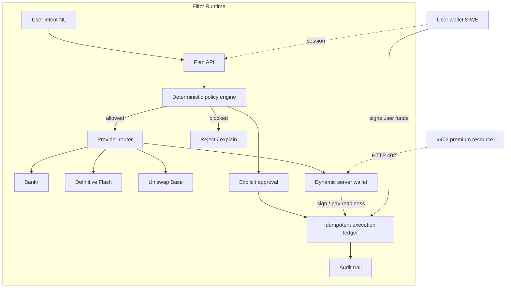

# Flitzr

<div align="center">

**Policy-First Autonomous Financial Agent on Base**

[](https://base.org)
[](https://runtime.nyc/handbook)
[](https://www.dynamic.xyz/docs/overview/agents/overview)
[](https://www.typescriptlang.org/)
[](https://nextjs.org/)

**Natural language → policy → providers → approval → signing → settlement**

[Live App](https://flitzr.vercel.app) · [Dynamic Status](https://flitzr.vercel.app/api/dynamic/status) · [Submission](SUBMISSION.md)

</div>

---

## Why This Wins

| Feature | Typical agent app | **Flitzr** |
|---------|-------------------|------------|
| Intent | Free-form tools | **Structured plans** from natural language |
| Safety | Soft prompts | **Deterministic policy** (single-trade + daily limits) |
| Execution | Agent broadcasts | **Preview-first** — never auto-broadcasts |
| Wallet | User only | **User SIWE** + **Dynamic server wallet** for agent actions |
| Payments | Ad-hoc | **x402 v2** + agent payment readiness |
| Routing | Single DEX | **Bankr · Definitive · Uniswap** under one policy |
| Audit | Logs optional | **Idempotent ledger** + optional Postgres audit |

---

## Architecture



---

## Dynamic integration (Runtime track)

Flitzr uses Dynamic **Server wallets**:

| Pattern | Ownership | Auth | In Flitzr |
|---------|-----------|------|-----------|
| **Server wallets** | Developer account | API token | **Yes** — agent payments & signing |
| Agent wallets | Dynamic user | User JWT | Future |
| Delegated access | End-user embedded wallet | User-approved materials | Future |

**Agent flow**

1. Policy evaluates intent (limits + rules).
2. On approval, the agent may use a Dynamic server wallet on **Base** to sign or prepare payment actions (including x402-style flows).
3. **User funds** still require the user’s own wallet signature. Agent wallet ≠ user wallet.

**Reviewer endpoint:** [`GET /api/dynamic/status`](https://flitzr.vercel.app/api/dynamic/status) — configured / ready / address (no secrets).

Code: [`lib/dynamic.ts`](lib/dynamic.ts) · Docs: [Agents Overview](https://www.dynamic.xyz/docs/overview/agents/overview) · [Agent Payments](https://www.dynamic.xyz/docs/overview/agents/agent-payments)

---

## Provider model

| Provider | Role | State |
|----------|------|--------|
| **Bankr** | Agent + wallet operations | Server adapter / quotes |
| **Definitive Flash** | DCA + limit planning | Server quote / order adapter |
| **Uniswap** | Base spot routing | Trading API quote adapter |
| **Dynamic** | Agent server wallet + payment signing | Optional server-wallet adapter |
| **x402** | Premium resource payments | `@x402/next` payment proxy |

---

## Safety model

Flitzr is **preview-first**. An AI suggestion never directly broadcasts a transaction. State-changing actions must pass deterministic policy and, when required, explicit user approval. API keys are server-only and must never be committed or exposed to the browser.

---

## Quick start

```bash
git clone https://github.com/wadezigh96/flitzr.git
cd flitzr
npm install
cp .env.example .env.local
# Fill AUTH_SECRET, provider keys, DYNAMIC_* as needed
npm run dev
```

Open [http://localhost:3000](http://localhost:3000).

---

## Environment

```text
BANKR_API_KEY=
DEFINITIVE_API_KEY=
UNISWAP_API_KEY=
AUTH_SECRET=
POSTGRES_URL=
X402_PAY_TO=
X402_PRICE_USDC=0.01
X402_FACILITATOR_URL=
NEXT_PUBLIC_APP_URL=http://localhost:3000
DYNAMIC_AUTH_TOKEN=
DYNAMIC_ENVIRONMENT_ID=
```

Use least-privileged production credentials. Never paste secrets into chat, issues, commits, or screenshots.

---

## Main API surfaces

| Method | Path | Purpose |
|--------|------|---------|
| POST | `/api/auth/nonce` | Wallet auth nonce |
| POST | `/api/auth/verify` | Verify SIWE session |
| POST | `/api/auth/logout` | Revoke session cookie |
| POST | `/api/plan` | Parse & evaluate intent |
| POST | `/api/execution` | Idempotent policy-checked plan |
| POST | `/api/execution/approve` | Explicit approval |
| GET | `/api/execution/audit` | Authenticated audit history |
| POST | `/api/quote` | Provider quote preview |
| GET | `/api/x402/premium` | x402-protected resource |
| GET | `/api/dynamic/status` | Dynamic server wallet readiness |

---

## Project structure

```
flitzr/
├── app/                 # Next.js App Router + API routes
├── components/
├── lib/
│   ├── auth.ts          # SIWE sessions
│   ├── policy.ts        # Deterministic limits
│   ├── execution.ts / ledger.ts / audit.ts
│   ├── bankr.ts / definitive.ts / uniswap.ts
│   ├── dynamic.ts       # Dynamic server wallets
│   └── x402.ts
├── proxy.ts             # x402 payment proxy
├── SUBMISSION.md        # Runtime form copy
└── README.md
```

---

## Tracks (Runtime NYC)

| Track | Fit |
|-------|-----|
| **Bankr grand prize** | Auto-eligible — policy-first agent on Base |
| **Dynamic** | Server wallets for agentic wallet / payment experience |
| **Definitive Flash** | DCA / limit social trading build |
| **Uniswap** | Base spot routing / new assets agents |

Submit by **Saturday, September 19, 2026, 4 PM EDT**. Online entries need a recorded demo.

---

## CI

```bash
npm install
npx tsc --noEmit
npm run build
```

---

## Production checklist

- Stable `AUTH_SECRET`, Postgres, provider credentials
- Rate limiting, monitoring, receipt polling
- Small-fund / test validation before real money
- Dynamic: `DYNAMIC_AUTH_TOKEN` + `DYNAMIC_ENVIRONMENT_ID` set; `/api/dynamic/status` → `ready: true`

---

<div align="center">

**Built for Runtime NYC · Base · Bankr · Dynamic**  
*Plan with policy. Sign with intent. Never broadcast blind.*

[Live](https://flitzr.vercel.app) · [GitHub](https://github.com/wadezigh96/flitzr) · [Submission guide](SUBMISSION.md)

</div>
